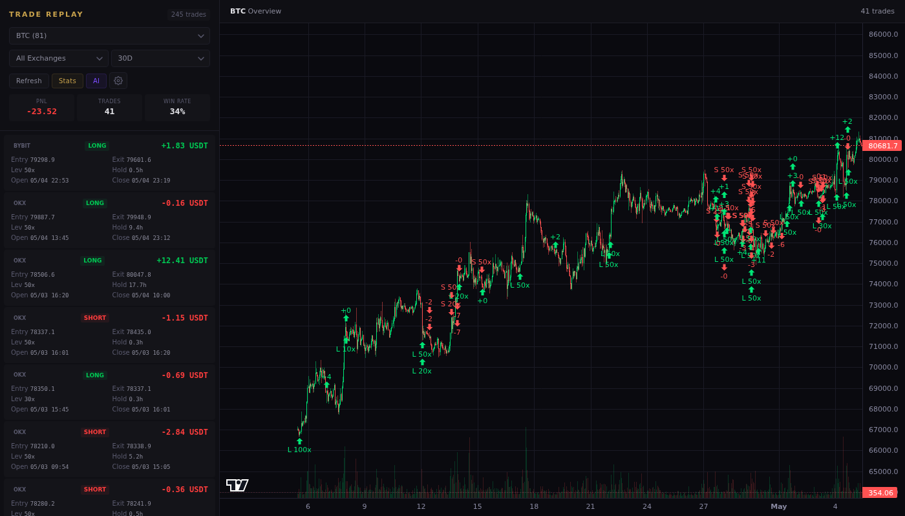
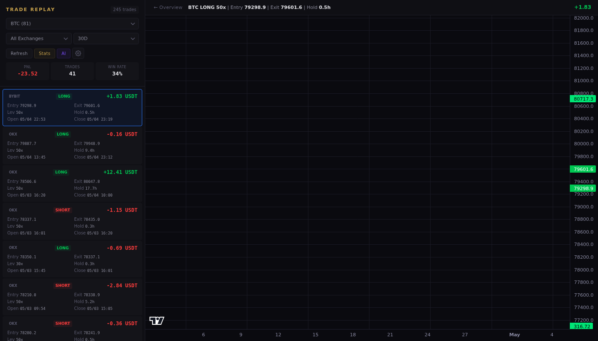
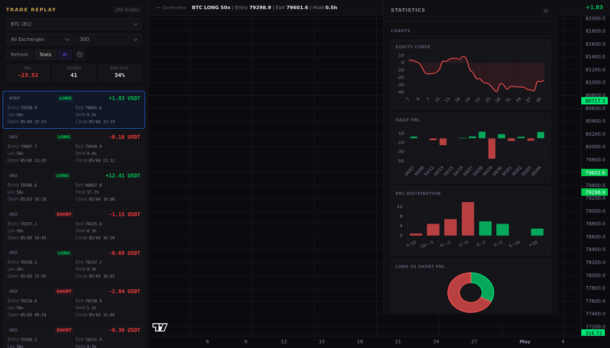
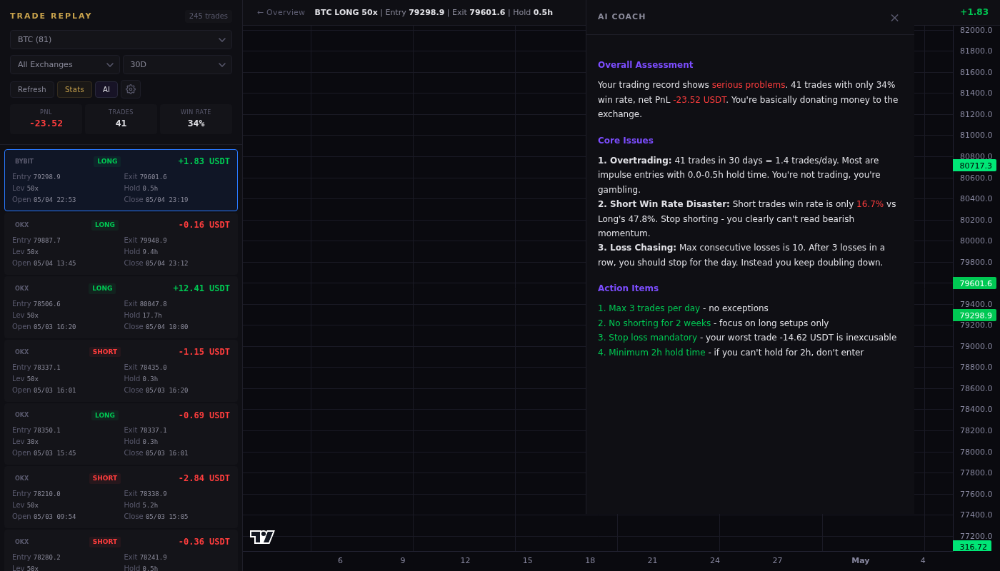
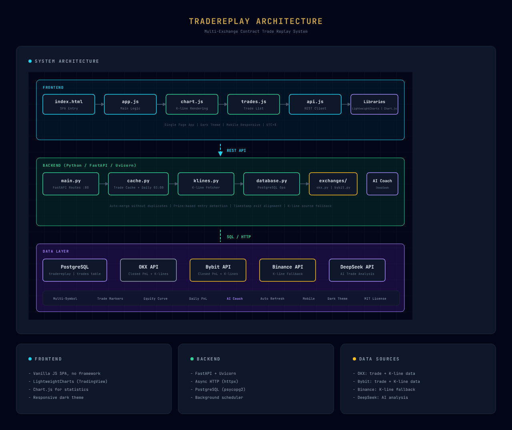

# TradeReplay

Multi-exchange contract trade replay tool — visualize your closed positions on K-line charts with entry/exit markers.

## Screenshots

### Overview — K-line chart with trade markers


### Trade Detail — Entry/exit price lines on K-lines


### Statistics — Equity curve, daily PnL, distribution


### AI Analysis — AI Trading Coach


## Architecture



## Features

- Multi-exchange support (OKX, Bybit) with unified data format
- K-line chart with entry/exit markers (LightweightCharts)
- Price-based entry detection, timestamp-based exit alignment
- Auto fallback across K-line sources (Binance → OKX → Bybit)
- Statistics panel: equity curve, daily PnL, PnL distribution
- AI Trading Coach — harsh feedback on trading patterns
- Multi-symbol dropdown selector
- Dark theme, mobile responsive
- UTC+8 time display
- PostgreSQL persistent storage
- Daily auto-refresh (03:00)

## Quick Start (Other Linux Servers)

### 1. Prerequisites

```bash
# CentOS / OpenCloudOS / RHEL
sudo yum install -y python3 python3-pip postgresql-server postgresql-devel
sudo postgresql-setup --initdb
sudo systemctl start postgresql
sudo systemctl enable postgresql

# Ubuntu / Debian
sudo apt install -y python3 python3-pip postgresql postgresql-contrib
sudo systemctl start postgresql
sudo systemctl enable postgresql
```

### 2. Clone & Install

```bash
git clone https://github.com/Ibook000/TradeReplay.git
cd TradeReplay
pip3 install -r requirements.txt psycopg2-binary
```

### 3. Setup Database

```bash
# Create user and database
sudo -u postgres psql <<'EOF'
CREATE USER tradereplay WITH PASSWORD 'your_password';
CREATE DATABASE tradereplay OWNER tradereplay;
\q
EOF

# Import schema
psql -U tradereplay -d tradereplay -h localhost -f schema.sql
```

If password auth fails, edit `pg_hba.conf`:
```bash
# Find config location
sudo -u postgres psql -c "SHOW hba_file;"

# Change 'ident' to 'md5' for local connections, then restart
sudo systemctl restart postgresql
```

### 4. Configure API Keys

```bash
cp .env.example .env
cp exchanges/keys.py.example exchanges/keys.py
```

Edit `.env`:
```
OKX_API_KEY=your_key
OKX_SECRET_KEY=your_secret
OKX_PASSPHRASE=your_passphrase
BYBIT_API_KEY=your_key
BYBIT_SECRET_KEY=your_secret
AI_BASE_URL=https://api.deepseek.com/v1
AI_API_KEY=your_ai_key
AI_MODEL=deepseek-chat
```

Edit `exchanges/keys.py` with the same credentials.

### 5. Run

```bash
python3 main.py
```

Open `http://your-server-ip:80` in browser.

### 6. Run as Systemd Service (Recommended)

```bash
sudo tee /etc/systemd/system/tradereplay.service <<'EOF'
[Unit]
Description=TradeReplay
After=postgresql.service

[Service]
Type=simple
User=root
WorkingDirectory=/root/TradeReplay
ExecStart=/usr/bin/python3 main.py
Restart=always
RestartSec=5

[Install]
WantedBy=multi-user.target
EOF

sudo systemctl daemon-reload
sudo systemctl start tradereplay
sudo systemctl enable tradereplay

# Check status
sudo systemctl status tradereplay
sudo journalctl -u tradereplay -f
```

### 7. Update

```bash
cd TradeReplay
git pull
sudo systemctl restart tradereplay
```

## Database Connection

Default config reads from environment or uses these defaults:
- Host: `localhost`
- Port: `5432`
- Database: `tradereplay`
- User: `tradereplay`

Override in `.env`:
```
DB_HOST=localhost
DB_PORT=5432
DB_NAME=tradereplay
DB_USER=tradereplay
DB_PASS=your_password
```

## API Keys Setup

| Exchange | Keys Needed | Notes |
|----------|-------------|-------|
| OKX | API Key, Secret Key, Passphrase | Read-only permission sufficient |
| Bybit | API Key, Secret Key | Read-only permission sufficient |
| AI | API Key | Optional, for AI Trading Coach |

## Project Structure

```
TradeReplay/
├── main.py              # FastAPI routes + startup
├── database.py          # PostgreSQL operations
├── cache.py             # Trade cache + daily refresh scheduler
├── klines.py            # K-line fetchers (Binance, OKX, Bybit)
├── schema.sql           # Database schema
├── .env.example         # Environment template
├── requirements.txt     # Python dependencies
├── exchanges/
│   ├── __init__.py      # Unified trade fetching
│   ├── okx.py           # OKX adapter
│   ├── bybit.py         # Bybit adapter
│   └── keys.py.example  # Keys template
└── static/
    ├── index.html       # SPA frontend
    ├── css/style.css    # Dark theme + mobile
    └── js/
        ├── app.js       # Main logic
        ├── api.js       # API client
        ├── chart.js     # K-line rendering
        ├── trades.js    # Trade list
        └── utils.js     # Helpers
```

## License

MIT
